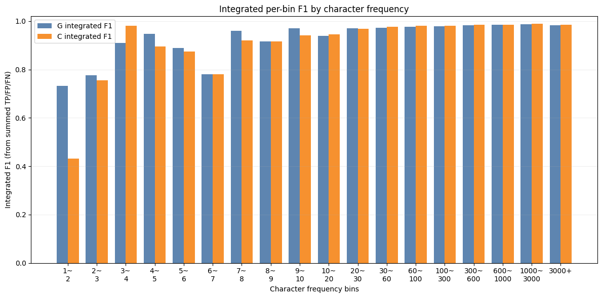

# Intro
C와 G는 전체성능에서는 G가 약하지만
글자 단위로 평가를 하면 few shot, zero shot 등에서 효과를 확인할 수 잇을지도

# Metric
frequency-binned character F1 evaluation protocol
* 평가 셋에 대해 글자별로 tp, tn, fp, fn를 구한다.
* 학습 데이터 셋에 등장 빈도에 대해 구간 값을 정한다.
* 각 구간에 속한 글자들에 대해 tp, tn, fp, fn를 통합한 뒤 f1을 구한다.

* 글자별 f1을 평균하는 경우에는 문제가 있는데, 모델이 추론시 등장 빈도가 적은 글자로 잘못 추론 하는 경우, f1이 낮은 글자 항목이 늘어나서 평균 시 낮아지는 편향이 발생

# Result

0~
1 (num chars in char_count: 0)
  C -> tp=0, tn=0, fp=0, fn=0, f1=0.0000
  G -> tp=0, tn=0, fp=0, fn=0, f1=0.0000

1~
2 (num chars in char_count: 200)
  C -> tp=8, tn=5085310, fp=0, fn=21, f1=0.4324
  G -> tp=22, tn=7028394, fp=9, fn=7, f1=0.7333

2~
3 (num chars in char_count: 97)
  C -> tp=17, tn=6053947, fp=0, fn=11, f1=0.7556
  G -> tp=19, tn=6543771, fp=2, fn=9, f1=0.7755

3~
4 (num chars in char_count: 61)
  C -> tp=26, tn=5085312, fp=0, fn=1, f1=0.9811
  G -> tp=25, tn=5574319, fp=3, fn=2, f1=0.9091

4~
5 (num chars in char_count: 43)
  C -> tp=17, tn=4358841, fp=2, fn=2, f1=0.8947
  G -> tp=18, tn=4120151, fp=1, fn=1, f1=0.9474

5~
6 (num chars in char_count: 26)
  C -> tp=14, tn=2905890, fp=0, fn=4, f1=0.8750
  G -> tp=16, tn=3150699, fp=2, fn=2, f1=0.8889

6~
7 (num chars in char_count: 30)
  C -> tp=16, tn=3874288, fp=3, fn=6, f1=0.7805
  G -> tp=16, tn=3877783, fp=3, fn=6, f1=0.7805

7~
8 (num chars in char_count: 26)
  C -> tp=23, tn=3874055, fp=2, fn=2, f1=0.9200
  G -> tp=24, tn=3393056, fp=1, fn=1, f1=0.9600

8~
9 (num chars in char_count: 23)
  C -> tp=22, tn=4116677, fp=1, fn=3, f1=0.9167
  G -> tp=22, tn=4120145, fp=1, fn=3, f1=0.9167

9~
10 (num chars in char_count: 16)
  C -> tp=16, tn=2179413, fp=1, fn=1, f1=0.9412
  G -> tp=16, tn=2181250, fp=0, fn=1, f1=0.9697

10~
20 (num chars in char_count: 125)
  C -> tp=205, tn=24457599, fp=11, fn=13, f1=0.9447
  G -> tp=208, tn=24720772, fp=17, fn=10, f1=0.9391

20~
30 (num chars in char_count: 74)
  C -> tp=198, tn=16224442, fp=6, fn=7, f1=0.9682
  G -> tp=200, tn=16238109, fp=7, fn=5, f1=0.9709

30~
60 (num chars in char_count: 139)
  C -> tp=692, tn=32932900, fp=16, fn=16, f1=0.9774
  G -> tp=686, tn=32960643, fp=17, fn=22, f1=0.9724

60~
100 (num chars in char_count: 95)
  C -> tp=908, tn=23004161, fp=13, fn=23, f1=0.9806
  G -> tp=908, tn=23023535, fp=19, fn=23, f1=0.9774

100~
300 (num chars in char_count: 231)
  C -> tp=5228, tn=55933309, fp=56, fn=136, f1=0.9820
  G -> tp=5211, tn=55980413, fp=76, fn=153, f1=0.9785

300~
600 (num chars in char_count: 141)
  C -> tp=7574, tn=34136619, fp=75, fn=151, f1=0.9853
  G -> tp=7544, tn=34165378, fp=80, fn=181, f1=0.9830

600~
1000 (num chars in char_count: 76)
  C -> tp=7211, tn=18396661, fp=62, fn=150, f1=0.9855
  G -> tp=7202, tn=18412168, fp=59, fn=159, f1=0.9851

1000~
3000 (num chars in char_count: 170)
  C -> tp=35855, tn=41130345, fp=247, fn=583, f1=0.9886
  G -> tp=35810, tn=41165043, fp=229, fn=628, f1=0.9882

3000+ (num chars in char_count: 167)
  C -> tp=179946, tn=40255338, fp=2582, fn=2687, f1=0.9856
  G -> tp=179828, tn=40288808, fp=3180, fn=2805, f1=0.9836

  
빈도가 낮은 글자에 대해서는 G가 C 보다 훨씬 안정적인 성능을 보임